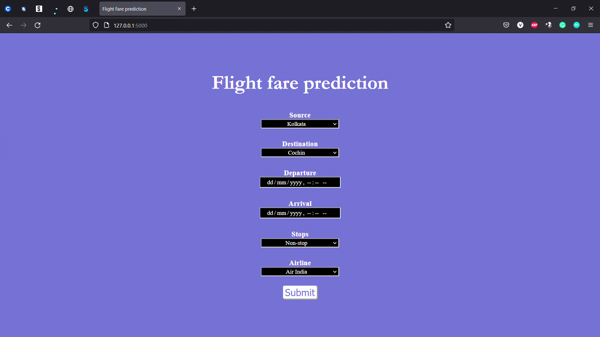

# Flight fare prediction

## Table of Content
  * [Demo](#demo)
  * [Synopsis](#synopsis)
  * [Appendix](#appendix)
  * [Links](#links)
  * [Directory Tree](#directory_tree)
  * [Color Reference](#color_reference)
  * [Features](#features)
  * [Run Locally](#run_locally)
  * [License](#license)
  * [Technology Used](#technology_used)

## Demo



## Synopsis

Flight fare prediction project is based on predicting the price of the flight ticket based on different features, this features includes, the airline in which you might travel, the date of journey, the place from where your journey begins source, the place where you reach destination, the route which you might take to reach your destination, this route also specifies the number of stops the airline stops inbetween the destination , the time for depature, the time of arrival, the time taken for you to travel from the source to the destination, and finally the price for the travel.

So based on the given data,
#### Independent variable (X) : Airline, Date_of_journey, Source, Destination, Route, Dep_Time, Arrival_Time, Duration, Total_Stops, Additional_Info
#### Dependent variable (Y) : Price

Based on the given data we can identify this as a regression problem, so we can use various machine learning problems to solve this problems which are as follows:

   * Linear regression
   * Lasso regression
   * Ridge regression
   * Decision tree regressor
   * Random forest regressor

I have declared this problem with random forest regression, since linear regression model doesn't gave me much accuracy.

Machine learning model : Random forest regressor (sklearn)

Data preprocessing : Pandas

Data visualization : Matplotlib, Seaborn

Web framework : Flask

Model deployment : Heroku platform

## Appendix

The requirement for developing this model is present in the [requirements.txt](https://github.com/Vedakeerthi/FLIGHT_FARE_PREDICTION/blob/main/requirements.txt) file.

The development of the model is present in the [main.ipynb](https://github.com/Vedakeerthi/FLIGHT_FARE_PREDICTION/blob/main/main.ipynb) file.

The pickle file of the model for deployment is present in [car price prediction](https://github.com/Vedakeerthi/FLIGHT_FARE_PREDICTION/blob/main/Flight_fare_prediction.pkl) folder.

The flask framework for the web app development is made in the [app.py](https://github.com/Vedakeerthi/FLIGHT_FARE_PREDICTION/blob/main/app.py) file.

The templates for the framework is done in html and css and the file is located in the [templates](https://github.com/Vedakeerthi/FLIGHT_FARE_PREDICTION/tree/main/templates) folder.

## Links

 - #### Dataset link : https://www.kaggle.com/datasets/nikhilmittal/flight-fare-prediction-mh
 - #### Github link : https://github.com/Vedakeerthi/FLIGHT_FARE_PREDICTION
 - #### Heroku link : https://flight-fare-prediction-app.herokuapp.com/
 
## Directory Tree <a name='directory_tree'></a>

```
├── template
│   ├── home.html
    ├── style
        ├── css
            ├── stylesheet.css
├── Procfile
├── README.md
├── Data_Train.xlsx
├── model-gif.gif
├── app.py
├── main.ipynb
|── Flight_fare_prediciton.pkl
├── requirements.txt
```
 
## Color Reference <a name='color_reference'></a>

| Color                   | Hex                                                                  |
| ------------------------| ---------------------------------------------------------------------|
| Body of the web page    |  #6767bd |
| Border of the web page  |  #000000 |
| Font color for head, h3 |  #ffffff |
| Submit button border    |  #808080 |
| Submit button color     |  #6767bd |


## Features

- Live prediction analysis.
- Fullscreen mode supports in mobile, pc.
- Cross platform can be used on multiple operating system.


## Run Locally <a name='run_locally'></a>

Clone the project

```bash
  git clone https://github.com/Vedakeerthi/FLIGHT_FARE_PREDICTION.git
```

Install dependencies

```bash
  pip install -r requirements.txt
```

Start the server

```bash
  python app.py
```

Run the app on server by the local link provided


## License

[](https://github.com/Vedakeerthi/FLIGHT_FARE_PREDICTION/blob/main/LICENSE)

## Technology Used <a name='technology_used'></a>

<a href="https://www.python.org" target="_blank" rel="noreferrer">  </a> &nbsp;
<a href="https://scikit-learn.org/" target="_blank" rel="noreferrer">  </a> &nbsp;
<a href='https://flask.palletsprojects.com/en/2.1.x/' target="_blank" rel="noreferrer"> </a> &nbsp;
<a href='https://gunicorn.org/' targe="_blank" rel="noreferrer"></a> &nbsp;
